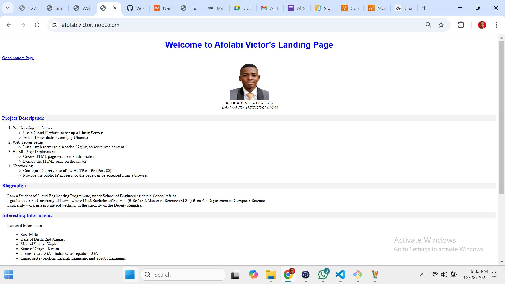

# DOCUMENTATION OF MY PROJECT
 
## To View Webpage
IP Address: (http://54.229.229.203/)  
Domain Name: afolabivictor.mooo.com

## How to Provisioned the Server
*Create a AWS account  
*Login to your AWS console  
*Click on “Instance” at the side bar (or from Services menu)  
*Click on “Launch Instance” at the top-right corner  
*Give your server a “Name”  
*Choose the Operating System to run: “Ubuntu server 2.2” and “t2 micro” instance type  
*Create a “Keypair” for connecting to the server  
*Setup other configurations and specifications …  
*Click on “Launch Instance”

## How to Install Web Server
*SSH into your server  
*Press the command “sudo apt install nginx”, then press the Enter Key  
*Press the command “systemctl status nginx”, then press the Enter key  
*To run the server, paste the Public ipV4 address on a browser search box  
*If properly installed, it will display WELCOME TO NGINX

## How to Deploy the HTML Page
*Create a New Repository on your GitUp Account  
*Press the command “cd /path/to/your/folder”	#to navigate into your folder directory  
*Press the command “git init”	# To Initialize Git repository  
*Press the command “git add .”	# To Add all files to the staging area  
*Press the command “git commit -m "Your commit message"” # To add commit message  
*Press the command “git remote add origin <repository_URL>”  # Link to your remote Repo  
*Press the command “git push -u origin main”          # Push to the remote repository  

*SSH into your server  
*Press the command “cd /var/www/html”, to enter the directory of the web server  
*Press the command “sudo rm index.nginx-debian.html”, to remove the default HTML file from the server directory  
*Press the command “cd ~” to go to the Home directory  
*Press the command “git clone https://github.com/Vicktour358/Second-Semester-Examination”, to clone GitUp Repository  
*Press the command “cd Second-Semester-Examination”, to enter into the Repo Directory  
*Press the command “sudo mv index.html /var/www/html”, to move desired HTML file to the server directory  

## How to Configured Networking
*Login to your AWS Console  
*Click on “Security Groups” at the side bar (or from Services menu)  
*Click on “Add Rule”  
*Set Rule 1 to SSH Type, Port 22, Anywhere ipV4 Source, Allow SSH description  
*Set Rule 2 to Custom TCP Type, Port 80, Anywhere ipV4 Source, Open Port 80 description  
*Click on “Save Rule” 

## Screenshots of my Project
Successful Installation of Web Server (NGINX)
")

Successful Deployment of HTML Web Page
